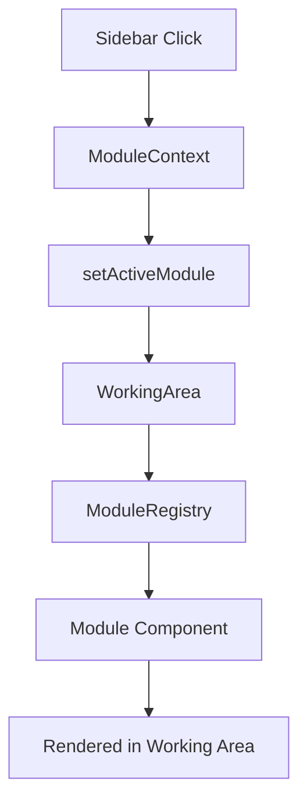
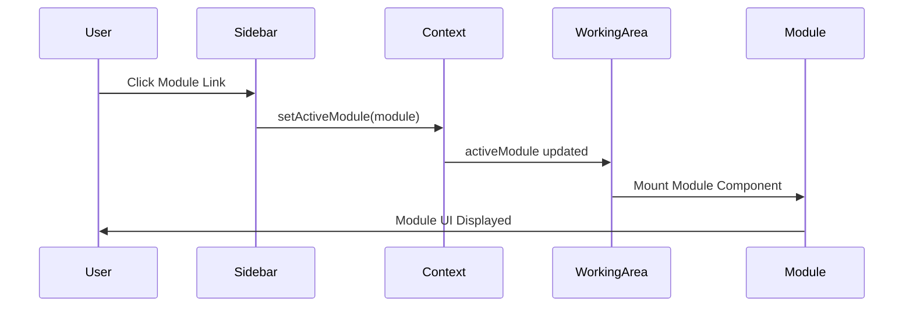

# Module System Architecture Documentation

## Overview

This document provides a comprehensive technical guide to the modular dashboard system implemented in the PDIS Frontend application. The system allows users to dynamically load different modules into the working area without page navigation, providing a seamless single-page application (SPA) experience.

## Table of Contents

1. [Architecture Overview](#architecture-overview)
2. [Technology Stack](#technology-stack)
3. [Core Components](#core-components)
4. [Implementation Details](#implementation-details)
5. [Data Flow](#data-flow)
6. [File Structure](#file-structure)
7. [Adding New Modules](#adding-new-modules)
8. [Best Practices](#best-practices)
9. [Troubleshooting](#troubleshooting)

## Architecture Overview

The module system follows a **Context-Provider pattern** combined with a **Registry pattern** to achieve dynamic module loading. The architecture consists of three main layers:

1. **Context Layer**: Manages global state for active modules
2. **Registry Layer**: Maps module IDs to their respective components
3. **Component Layer**: Individual module implementations



## Technology Stack

### Core Technologies
- **React 18+**: Component-based UI library with hooks
- **TypeScript**: Type-safe JavaScript with static typing
- **Next.js 14+**: React framework with App Router
- **Tailwind CSS**: Utility-first CSS framework

### Key React Patterns Used
- **Context API**: For global state management
- **Custom Hooks**: For encapsulating logic (`useModule`)
- **Dynamic Components**: Runtime component selection
- **Compound Components**: Modular component composition

### UI Libraries
- **Lucide React**: Icon library for consistent iconography
- **Radix UI**: Accessible component primitives (sidebar, tooltips)

## Core Components

### 1. ModuleContext (`src/contexts/ModuleContext.tsx`)

**Purpose**: Provides global state management for the active module.

```typescript
interface ModuleData {
  id: string
  title: string
  component: React.ComponentType
}

interface ModuleContextType {
  activeModule: ModuleData | null
  setActiveModule: (module: ModuleData | null) => void
}
```

**Key Features**:
- Centralized state management using React Context
- Type-safe module data structure
- Custom hook for easy consumption

**Implementation Pattern**:
```typescript
// Provider wraps the entire dashboard
<ModuleProvider>
  <DashboardContent />
</ModuleProvider>

// Components consume context via custom hook
const { activeModule, setActiveModule } = useModule()
```

### 2. ModuleRegistry (`src/components/modules/ModuleRegistry.tsx`)

**Purpose**: Maps module IDs to their component implementations.

**Key Features**:
- **Static Registry**: Compile-time module registration
- **Lazy Loading Ready**: Can be extended for code splitting
- **Generic Component Factory**: Reusable placeholder components

**Registry Structure**:
```typescript
export const moduleRegistry: Record<string, ModuleData> = {
  'supplies-requisition': {
    id: 'supplies-requisition',
    title: 'Supplies Requisition',
    component: SuppliesRequisitionModule
  },
  // ... other modules
}
```

### 3. WorkingArea (`src/components/WorkingArea.tsx`)

**Purpose**: Conditionally renders either the active module or default dashboard.

**Conditional Rendering Logic**:
```typescript
export default function WorkingArea() {
  const { activeModule } = useModule()

  if (activeModule) {
    const ModuleComponent = activeModule.component
    return <ModuleComponent />
  }

  // Default dashboard layout
  return <DefaultDashboardLayout />
}
```

### 4. Dashboard Layout (`src/app/dashboard/layout.tsx`)

**Purpose**: Manages sidebar interactions and module activation.

**Module Activation Flow**:
```typescript
const handleModuleClick = (moduleId: string) => {
  const module = moduleRegistry[moduleId]
  if (module) {
    setActiveModule(module)
  }
}

// Sidebar menu items
{genAdServices.map((item) => (
  <SidebarMenuButton 
    onClick={() => handleModuleClick(item.moduleId)}
  >
    {item.title}
  </SidebarMenuButton>
))}
```

## Implementation Details

### State Management Strategy

**Why Context API over Redux?**
- **Simplicity**: Single state value (activeModule)
- **Performance**: No complex state updates or selectors
- **Bundle Size**: No additional dependencies
- **Type Safety**: Full TypeScript integration

**State Structure**:
```typescript
type ModuleState = {
  activeModule: ModuleData | null
}
```

### Component Registration Strategy

**Registry Pattern Benefits**:
- **Decoupled Architecture**: Modules don't know about each other
- **Easy Extension**: Add new modules by updating registry
- **Type Safety**: Compile-time checks for module existence
- **Performance**: No runtime module discovery

### Dynamic Component Rendering

**Component Resolution**:
```typescript
// At runtime, components are resolved from registry
const ModuleComponent = activeModule.component
return <ModuleComponent />
```

**Memory Management**:
- Components are only instantiated when active
- Previous module components are garbage collected
- No component pre-loading (can be added later)

## Data Flow

### Module Activation Sequence

1. **User Interaction**: User clicks sidebar module link
2. **Event Handler**: `handleModuleClick(moduleId)` is triggered
3. **Registry Lookup**: Module data retrieved from `moduleRegistry[moduleId]`
4. **Context Update**: `setActiveModule(module)` updates global state
5. **Re-render Trigger**: All consumers of `useModule()` re-render
6. **Conditional Render**: `WorkingArea` renders active module component
7. **Component Mounting**: Selected module component mounts in working area

### State Synchronization



## File Structure

```
src/
├── contexts/
│   └── ModuleContext.tsx           # Global module state management
├── components/
│   ├── modules/
│   │   ├── ModuleRegistry.tsx      # Module mapping and registration
│   │   ├── SuppliesRequisitionModule.tsx
│   │   ├── OpexBudgetModule.tsx
│   │   └── [other-modules].tsx
│   └── WorkingArea.tsx             # Conditional module renderer
├── app/
│   └── dashboard/
│       ├── layout.tsx              # Sidebar and module activation
│       └── page.tsx                # Default dashboard content
└── docs/
    └── MODULE_SYSTEM_ARCHITECTURE.md
```

## Adding New Modules

### Step 1: Create Module Component

```typescript
// src/components/modules/NewModule.tsx
"use client"

import { SomeIcon } from "lucide-react"

export default function NewModule() {
  return (
    <div className="h-full p-6">
      <div className="flex items-center gap-3 mb-6">
        <SomeIcon className="w-8 h-8 text-blue-500" />
        <h1 className="text-3xl font-semibold text-gray-700">New Module</h1>
      </div>
      <div className="bg-white rounded-lg shadow-sm border p-6">
        {/* Module content here */}
      </div>
    </div>
  )
}
```

### Step 2: Register Module

```typescript
// src/components/modules/ModuleRegistry.tsx
import NewModule from './NewModule'

export const moduleRegistry: Record<string, ModuleData> = {
  // ... existing modules
  'new-module': {
    id: 'new-module',
    title: 'New Module',
    component: NewModule
  }
}
```

### Step 3: Add to Sidebar

```typescript
// src/app/dashboard/layout.tsx
const someMenuArray = [
  // ... existing items
  {
    title: "New Module",
    moduleId: "new-module",
  }
]
```

### Step 4: Handle Module Activation

The existing `handleModuleClick` function will automatically handle the new module since it uses the registry pattern.

## Best Practices

### Component Design

1. **Consistent Layout Structure**:
   ```typescript
   <div className="h-full p-6">
     <div className="flex items-center gap-3 mb-6">
       <Icon className="w-8 h-8 text-blue-500" />
       <h1 className="text-3xl font-semibold text-gray-700">{title}</h1>
     </div>
     <div className="bg-white rounded-lg shadow-sm border p-6">
       {/* Module content */}
     </div>
   </div>
   ```

2. **Error Boundaries**: Wrap module components in error boundaries
3. **Loading States**: Implement loading states for async operations
4. **Responsive Design**: Use Tailwind responsive utilities

### Performance Optimization

1. **Code Splitting**: Use dynamic imports for large modules
   ```typescript
   const LazyModule = lazy(() => import('./HeavyModule'))
   ```

2. **Memoization**: Use `React.memo` for expensive components
3. **State Cleanup**: Clear module-specific state on unmount

### Type Safety

1. **Module Interface**: Always type module props and state
2. **Registry Types**: Keep registry types in sync with components
3. **Context Types**: Use strict typing for context values

## Troubleshooting

### Common Issues

1. **Module Not Loading**
   - Check if module is registered in `moduleRegistry`
   - Verify `moduleId` matches registry key
   - Ensure component is properly exported

2. **TypeScript Errors**
   - Verify `ModuleData` interface compliance
   - Check component prop types
   - Ensure proper import statements

3. **Context Not Available**
   - Verify `ModuleProvider` wraps consuming components
   - Check if `useModule` is called inside provider tree
   - Ensure context is not accessed during SSR

### Debugging Tools

1. **React DevTools**: Inspect context values and component tree
2. **Console Logging**: Add logs in `handleModuleClick` and `setActiveModule`
3. **TypeScript Compiler**: Use `tsc --noEmit` for type checking

### Performance Monitoring

1. **React Profiler**: Monitor component render times
2. **Bundle Analysis**: Use `@next/bundle-analyzer` for bundle size
3. **Memory Usage**: Monitor component mount/unmount cycles

## Future Enhancements

### Planned Features

1. **Module Permissions**: Role-based module access
2. **Module History**: Browser history integration
3. **Deep Linking**: URL-based module activation
4. **Module Communication**: Inter-module message passing
5. **Lazy Loading**: Code splitting for large modules
6. **Module Caching**: Cache module state between switches

### Scalability Considerations

1. **Module Federation**: Micro-frontend architecture
2. **State Management**: Upgrade to Zustand/Redux for complex state
3. **Module Registry**: Dynamic module discovery
4. **Performance**: Virtual scrolling for large module lists

## Conclusion

This module system provides a scalable, maintainable solution for dynamic content loading in a React/Next.js application. The combination of Context API, Registry pattern, and TypeScript ensures type safety, performance, and developer experience. The architecture is designed to grow with the application's needs while maintaining simplicity and reliability.

For questions or contributions, please refer to the main project documentation or create an issue in the project repository.